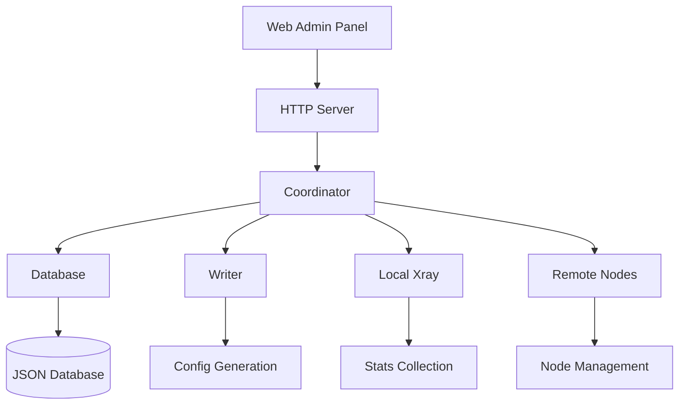

# Comprehensive Documentation Index

Welcome to the Arch-Manager documentation. This index provides access to all technical documentation covering system architecture, deployment, and operation.

## 📚 Documentation Overview

### Core Documentation

| Document | Description | Audience |
|----------|-------------|----------|
| **[Architecture](ARCHITECTURE.md)** | System design and component interaction | Developers, DevOps |
| **[Database Design](DATABASE.md)** | Data storage and management | Developers, Admins |
| **[Node Connection](NODE_CONNECTION.md)** | Node communication protocols | DevOps, Network Admins |
| **[Admin Panel](ADMIN_PANEL.md)** | Web interface usage guide | End Users, Admins |
| **[Xray Binaries](XRAY_BINARIES.md)** | Xray-core binary management | System Admins |

## 🏗️ System Architecture Overview

Arch-Manager is a **centralized proxy management platform** built in Go that orchestrates distributed Xray-core nodes. The system provides:

- **Centralized Control**: Single point of management for multiple proxy nodes
- **Real-time Monitoring**: Live statistics and health monitoring
- **Automatic Configuration**: Dynamic config generation and distribution
- **User Management**: Complete user lifecycle with quota enforcement
- **High Availability**: Load balancing and failover capabilities

### Key Components



## 🚀 Quick Start Guide

### Prerequisites
- **OS**: Debian 10+ or Ubuntu 18.04+
- **Architecture**: amd64 (x86_64)
- **RAM**: 2GB minimum (4GB recommended)
- **Storage**: 10GB free space
- **Network**: Public IP address

### Installation Steps

1. **System Setup**
   ```bash
   # Update system
   apt-get update && apt-get upgrade -y
   
   # Install dependencies
   apt-get install -y make wget jq curl vim git openssl cron unzip
   
   # Optional: Enable BBR TCP optimization
   echo "net.core.default_qdisc=fq" >> /etc/sysctl.conf
   echo "net.ipv4.tcp_congestion_control=bbr" >> /etc/sysctl.conf
   sysctl -p
   ```

2. **Download and Install**
   ```bash
   # Clone repository
   git clone https://github.com/ebadidev/arch-manager.git
   cd arch-manager
   
   # Run setup
   make setup
   
   # Setup Xray binaries
   make setup-xray
   ```

3. **First Access**
   ```bash
   # Access web interface
   # URL: http://your-server-ip:8080
   # Username: admin
   # Password: password
   ```

## 📊 How It Works

### 1. System Initialization

```
┌─────────────────┐    ┌─────────────────┐    ┌─────────────────┐
│   main.go       │    │   cmd/start.go  │    │  internal/app/  │
│                 │    │                 │    │      app.go     │
│ Entry Point     │ -> │ CLI Command     │ -> │ App Bootstrap   │
│ calls cmd.Execute() │    │ Creates App     │    │ Initialize All  │
└─────────────────┘    └─────────────────┘    └─────────────────┘
```

**App Initialization Process:**
1. **Config Loading**: Read JSON configuration files
2. **Logger Setup**: Initialize structured logging
3. **Database Init**: Load or create JSON database
4. **Xray Setup**: Initialize local Xray-core instance
5. **HTTP Server**: Start web interface and API
6. **Coordinator**: Launch background workers
7. **Signal Handling**: Setup graceful shutdown

### 2. Database Operations

**Storage Engine**: JSON file-based database (`storage/database/app.json`)

**Data Structure**:
```json
{
  "settings": {
    "admin_password": "password",
    "host": "127.0.0.1",
    "ss_relay_port": 8443,
    "ss_reverse_port": 8444,
    "traffic_ratio": 1.0
  },
  "stats": {
    "total_usage": 0.0,
    "total_usage_bytes": 0,
    "total_usage_reset_at": 1692672000000
  },
  "users": [
    {
      "id": 1,
      "name": "user1",
      "quota": 50.0,
      "usage": 15.2,
      "enabled": true,
      "shadowsocks_password": "randompassword123",
      "shadowsocks_method": "chacha20-ietf-poly1305"
    }
  ],
  "nodes": [
    {
      "id": 1,
      "host": "192.168.1.100",
      "http_port": 8080,
      "http_token": "secure-token",
      "push_status": "available",
      "pull_status": "available"
    }
  ]
}
```

### 3. Node Communication

**Communication Protocol**: HTTP/JSON API

**Manager → Node Operations**:
```
Config Push:  POST /v1/configs  (Send Xray configuration)
Stats Pull:   GET  /v1/stats    (Collect usage statistics)
Health Check: GET  /v1/info     (Verify node availability)
```

**Connection Modes**:

1. **Relay Mode**: Manager forwards traffic to nodes
   ```
   Client → Manager:8443 → Node → Internet
   ```

2. **Reverse Mode**: Nodes establish tunnels back to manager
   ```
   Client → Manager:8444 → [Tunnel] → Node → Internet
   ```

3. **Direct Mode**: Manager handles traffic directly
   ```
   Client → Manager:8445 → Internet
   ```

4. **Remote Mode**: Clients connect directly to nodes
   ```
   Client → Node:8446 → Internet
   ```

### 4. Configuration Management

**Config Generation Process**:

```go
// Writer generates configs for local and remote Xray instances
func (w *Writer) LocalConfig() (*xray.Config, error) {
    clients := w.clients()  // Get active users
    
    // Create inbounds for different modes
    if w.database.Content.Settings.SsRelayPort > 0 {
        xc.Inbounds = append(xc.Inbounds, relayInbound)
    }
    if w.database.Content.Settings.SsReversePort > 0 {
        xc.Inbounds = append(xc.Inbounds, reverseInbound)
    }
    
    // Setup routing and load balancing
    // Configure outbounds to nodes
    
    return xc, nil
}
```

**Config Distribution**:
1. **Trigger**: User changes, settings updates, periodic sync
2. **Generation**: Writer creates node-specific configs
3. **Push**: HTTP POST to each node's `/v1/configs` endpoint
4. **Verification**: Status tracking and retry logic
5. **Activation**: Nodes restart Xray with new config

### 5. Statistics Collection

**Local Stats** (from manager's Xray):
```go
queryStats, err := c.xray.QueryStats()
// Returns: [{"name": "user>>>123>>>traffic>>>downlink", "value": 1048576}]

// Parse and update database
for _, qs := range queryStats {
    parts := strings.Split(qs.GetName(), ">>>")
    if parts[0] == "user" {
        users[parts[1]] += qs.GetValue()
    }
}
```

**Remote Stats** (from node Xray instances):
```go
response, err := c.hc.Do(http.MethodGet, url, node.HttpToken, nil)
// Parse same format from remote nodes
// Aggregate usage data
// Check quota enforcement
```

### 6. User Management

**User Lifecycle**:

1. **Creation**:
   ```go
   user := &User{
       Id:       d.GenerateUserId(),          // Sequential ID
       Identity: d.GenerateUserIdentity(),    // UUID
       Name:     "username",
       Password: d.GenerateUserPassword(),    // Random 16-char
       Method:   config.ShadowsocksMethod,
       Quota:    50.0,                        // GB limit
       Enabled:  true,
   }
   ```

2. **Config Generation**: Include in Xray client lists
3. **Usage Tracking**: Monitor bandwidth consumption
4. **Quota Enforcement**: Auto-disable when limit exceeded
5. **Monthly Reset**: Reset usage based on policy

### 7. Admin Panel Operation

**Web Interface Structure**:
```
/web/                     -> Static files (HTML/CSS/JS)
├── index.html           -> Login page
├── admin-users.html     -> User management
├── admin-nodes.html     -> Node management
├── admin-system.html    -> System settings
└── assets/              -> CSS, JS, images
```

**API Routes**:
```
Authentication:
POST /v1/sign-in         -> Login with admin credentials

User Management:
GET  /v1/users           -> List all users
POST /v1/users           -> Create new user
PUT  /v1/users/{id}      -> Update user
DELETE /v1/users/{id}    -> Delete user

Node Management:
GET  /v1/nodes           -> List all nodes
POST /v1/nodes           -> Add new node
PUT  /v1/nodes/{id}      -> Update node
DELETE /v1/nodes/{id}    -> Remove node

System Management:
GET  /v1/stats           -> System statistics
GET  /v1/settings        -> Current settings
POST /v1/settings        -> Update settings
POST /v1/settings/xray/restart -> Restart Xray
```

## 🔧 Configuration Details

### Environment Configuration

**File Locations** (managed by `internal/config/env.go`):
```go
type Env struct {
    DefaultConfigPath    string  // configs/main.defaults.json
    LocalConfigPath      string  // configs/main.example.json
    DatabasePath         string  // storage/database/app.json
    DatabaseBackupPath   string  // storage/database/backup-%s.json
    XrayConfigPath       string  // storage/app/xray.json
    XrayBinaryPath       string  // third_party/xray-linux-64/xray
    EnigmaKeyPath        string  // resources/ed25519_public_key.txt
}
```

**Configuration Priority**:
1. `configs/main.example.json` (if exists) - Local overrides
2. `configs/main.defaults.json` - Default values

### Network Ports

**Default Port Allocation**:
- `8080`: HTTP server (web interface + API)
- `8443`: Shadowsocks relay mode (configurable)
- `8444`: Shadowsocks reverse mode (configurable)
- `8445`: Shadowsocks direct mode (configurable)
- `8446`: Shadowsocks remote mode (configurable)

**Dynamic Ports**:
- Xray API: Random free port (auto-selected)
- Node internal: Random free ports for each node
- Load balancer: Automatic port assignment

## 🔍 Monitoring and Troubleshooting

### Log Files

**Application Logs**:
```
storage/logs/app-std.log    -> Standard output
storage/logs/app-err.log    -> Error output
storage/logs/xray-access.log -> Xray access logs
storage/logs/xray-error.log  -> Xray error logs
```

**System Logs**:
```bash
# Service status
systemctl status arch-manager

# Real-time logs
journalctl -f -u arch-manager

# Application logs
tail -f storage/logs/app-std.log
```

### Common Issues

1. **Service Won't Start**:
   ```bash
   # Check configuration
   ./arch-manager start --dry-run
   
   # Verify logs
   journalctl -u arch-manager --no-pager
   ```

2. **Node Connection Issues**:
   ```bash
   # Test direct connection
   curl -I http://node-ip:8080/
   
   # Check node logs
   journalctl -f -u arch-node-1
   ```

3. **Database Corruption**:
   ```bash
   # Restore from backup
   systemctl stop arch-manager
   cp storage/database/backup-monday-14.json storage/database/app.json
   systemctl start arch-manager
   ```

### Performance Monitoring

**System Metrics**:
```bash
# Resource usage
htop
iostat 1
iftop

# Network connections
netstat -tlnp | grep arch-manager
ss -tlnp | grep :8080
```

**Application Metrics**:
- User count and active connections
- Node health and response times
- Bandwidth usage per user/node
- Configuration sync success rates

## 📈 Scaling Considerations

### Capacity Limits

**Recommended Limits**:
- **Users**: 10,000 maximum (optimal: 1,000)
- **Nodes**: 1,000 maximum (optimal: 100)
- **Concurrent Connections**: 50,000 per node
- **Bandwidth**: 10Gbps per node

**Memory Usage**:
- Base system: ~100MB
- Per 1000 users: ~10MB additional
- Per 100 nodes: ~5MB additional

### High Availability Setup

**Database Replication**:
- Hourly automated backups (7-day retention)
- External backup storage recommended
- Database files are portable across instances

**Load Distribution**:
- Multiple nodes for geographic distribution
- Automatic failover when nodes become unavailable
- Health monitoring with 1-minute timeout

## 🔒 Security Features

### Authentication & Authorization
- **Admin Password**: Configurable via web interface
- **API Tokens**: Encrypted using Ed25519 (Enigma module)
- **Node Authentication**: Unique HTTP tokens per node
- **Session Management**: Token-based API access

### Traffic Security
- **Shadowsocks Encryption**: ChaCha20-Poly1305 for users
- **Node Communication**: Shadowsocks 2022 (AES-128-GCM)
- **API Security**: Bearer token authentication
- **Network Isolation**: Configurable proxy routing

### Data Protection
- **Configuration Security**: Sensitive data encrypted
- **Log Sanitization**: No passwords in logs
- **Backup Encryption**: Optional encrypted backups
- **Access Control**: Role-based permissions

## 🛠️ Development and Deployment

### Development Setup

```bash
# Local development
make local-setup
make local-run

# Build binary
make build

# Run tests
go test ./...

# Update dependencies
go mod tidy
```

### Production Deployment

**Service Installation**:
```bash
# Install as systemd service
make setup

# Enable auto-start
systemctl enable arch-manager

# Check status
systemctl status arch-manager
```

**Docker Deployment**:
```bash
# Using docker-compose
docker-compose up -d

# View logs
docker-compose logs -f arch-manager
```

### Backup and Recovery

**Automatic Backups**:
- Database backed up every hour
- 7-day retention (168 files)
- Backup naming: `backup-{weekday}-{hour}.json`

**Manual Backup**:
```bash
# Backup database
cp storage/database/app.json /backup/location/

# Backup entire system
tar -czf arch-manager-backup.tar.gz storage/ configs/
```

**Recovery Process**:
```bash
# Stop service
systemctl stop arch-manager

# Restore database
cp /backup/location/app.json storage/database/

# Restart service
systemctl start arch-manager
```

## 📞 Support and Resources

### Community Resources
- **GitHub Repository**: [github.com/ebadidev/arch-manager](https://github.com/ebadidev/arch-manager)
- **Documentation**: This comprehensive guide
- **Issue Tracker**: GitHub Issues for bug reports
- **Feature Requests**: GitHub Discussions

### Related Projects
- **[Arch-Node](https://github.com/ebadidev/arch-node)**: Distributed proxy nodes
- **[Xray-core](https://github.com/XTLS/Xray-core)**: Core proxy engine

This documentation provides complete coverage of the Arch-Manager system architecture, implementation details, and operational procedures. For specific technical questions, refer to the individual documentation files linked in this index.
